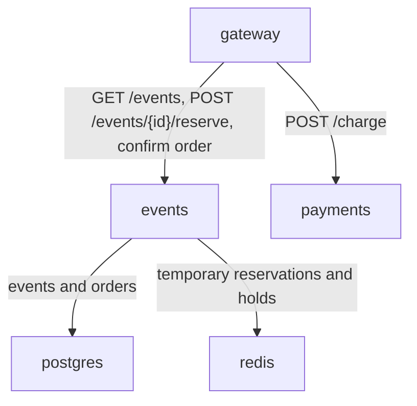

# Lab 1 - SRE Philosophy: Deploy, Break, Understand

## 1. Deploy QuickTicket

```text
$ docker compose ps
NAME             IMAGE                COMMAND                  SERVICE    CREATED          STATUS                   PORTS
app-events-1     app-events           "uvicorn main:app --..."   events     54 seconds ago   Up 49 seconds            0.0.0.0:8081->8081/tcp, [::]:8081->8081/tcp
app-gateway-1    app-gateway          "uvicorn main:app --..."   gateway    52 seconds ago   Up 48 seconds            0.0.0.0:3080->8080/tcp, [::]:3080->8080/tcp
app-payments-1   app-payments         "uvicorn main:app --..."   payments   54 seconds ago   Up 19 seconds            0.0.0.0:8082->8082/tcp, [::]:8082->8082/tcp
app-postgres-1   postgres:17-alpine   "docker-entrypoint.s..."   postgres   6 minutes ago    Up 2 minutes (healthy)   0.0.0.0:5432->5432/tcp, [::]:5432->5432/tcp
app-redis-1      redis:7-alpine       "docker-entrypoint.s..."   redis      6 minutes ago    Up 3 minutes (healthy)   0.0.0.0:6379->6379/tcp, [::]:6379->6379/tcp
```

## 2. Critical Path

### List events

```json
[
  {
    "id": 1,
    "name": "Go Conference 2026",
    "venue": "Main Hall A",
    "date": "2026-09-15T09:00:00+00:00",
    "total_tickets": 100,
    "price_cents": 5000,
    "available": 100
  },
  {
    "id": 4,
    "name": "Python Workshop",
    "venue": "Lab 301",
    "date": "2026-09-22T14:00:00+00:00",
    "total_tickets": 25,
    "price_cents": 2000,
    "available": 25
  },
  {
    "id": 2,
    "name": "SRE Meetup",
    "venue": "Room 204",
    "date": "2026-10-01T18:00:00+00:00",
    "total_tickets": 30,
    "price_cents": 0,
    "available": 30
  },
  {
    "id": 5,
    "name": "Kubernetes Deep Dive",
    "venue": "Auditorium B",
    "date": "2026-10-10T10:00:00+00:00",
    "total_tickets": 80,
    "price_cents": 8000,
    "available": 80
  },
  {
    "id": 3,
    "name": "Cloud Native Summit",
    "venue": "Expo Center",
    "date": "2026-11-20T10:00:00+00:00",
    "total_tickets": 500,
    "price_cents": 15000,
    "available": 500
  }
]
```

### Reserve one ticket

```json
{
  "reservation_id": "f88ffccf-8188-4cbb-9fec-e58c2dccc53f",
  "event_id": 1,
  "quantity": 1,
  "total_cents": 5000,
  "expires_in_seconds": 300
}
```

### Pay for the reservation

```json
{
  "order_id": "f88ffccf-8188-4cbb-9fec-e58c2dccc53f",
  "event_id": 1,
  "quantity": 1,
  "total_cents": 5000,
  "status": "confirmed"
}
```

### Healthy check

```text
{"status":"healthy","checks":{"events":"ok","payments":"ok","circuit_payments":"CLOSED"}}
HTTP_CODE=200
```

## 3. Dependency Map



Summary:

```text
gateway -> events -> postgres
gateway -> events -> redis
gateway -> payments
gateway -> events confirmation after payment
```

## 4. Failure Exploration

| Component Killed | Events List | Reserve | Pay | Health Check | User Impact |
|-----------------|-------------|---------|-----|--------------|-------------|
| payments | Works, HTTP 200 | Works, HTTP 200 | Fails with `{"detail":"Payment service unavailable"}`, HTTP 502 | `degraded`, payments `down`, HTTP 503 | Users can browse and reserve, but cannot pay. Reservations remain retryable while they have not expired. |
| events | Fails with `{"detail":"Events service unavailable"}`, HTTP 502 | Fails with `{"detail":"Events service unavailable"}`, HTTP 502 | Existing reservation returns `{"detail":"Payment succeeded but confirmation failed — contact support"}`, HTTP 500 | `degraded`, events `down`, HTTP 503 | Users cannot browse or reserve. Paying an existing reservation can create a bad partial-success experience: payment succeeds, order confirmation fails. |
| redis | Works, HTTP 200 | Fails with `{"detail":"Events service timeout"}`, HTTP 504 | Existing reservation returns `{"detail":"Payment succeeded but confirmation failed — contact support"}`, HTTP 500 | `degraded`, gateway reports events `down`, HTTP 503 | Users can browse events from Postgres, but reservations/confirmation depend on Redis and become unavailable or slow. |
| postgres | Fails with `{"detail":"Events service unavailable"}`, HTTP 502 | Fails with `Internal Server Error`, HTTP 500 | Existing reservation returns `{"detail":"Payment succeeded but confirmation failed — contact support"}`, HTTP 500 | `degraded`, events `degraded`, HTTP 503 | Event catalog and order writes are unavailable. Payment can still succeed before order confirmation fails, creating an inconsistency risk. |

## 5. Load Generator

I started the load generator at 5 requests/second for 30 seconds and stopped `payments` after the initial healthy period.

```text
$ ./app/loadgen/run.sh 5 30
QuickTicket Load Generator
Target: http://localhost:3080 | RPS: 5 | Duration: 30s
---
[10s] requests=38 success=38 fail=0 error_rate=0%
[10s] requests=39 success=39 fail=0 error_rate=0%
[10s] requests=40 success=40 fail=0 error_rate=0%
[10s] requests=41 success=41 fail=0 error_rate=0%
[20s] requests=79 success=78 fail=1 error_rate=1.2%
[20s] requests=80 success=78 fail=2 error_rate=2.5%
[20s] requests=81 success=78 fail=3 error_rate=3.7%
---
Done. total=117 success=109 fail=8 error_rate=6.8%
```

The error rate started at 0% while all services were healthy. After `payments` was stopped, requests that hit the full purchase path began failing, and the final error rate rose to 6.8%.

## 6. Graceful Degradation

### Gateway diff

```diff
diff --git a/app/gateway/main.py b/app/gateway/main.py
index c86db33..eef0a7d 100644
--- a/app/gateway/main.py
+++ b/app/gateway/main.py
@@ -332,6 +332,15 @@ async def pay_reservation(reservation_id: str):
     except CircuitOpenError:
         log.error("circuit open, skipping payments call")
         raise HTTPException(503, "Payment service temporarily unavailable (circuit open)")
+    except httpx.ConnectError:
+        return JSONResponse(
+            status_code=503,
+            content={
+                "error": "payments_unavailable",
+                "message": "Payment service is temporarily down. Your reservation is held — try again in a few minutes.",
+                "reservation_id": reservation_id,
+            },
+        )
     except httpx.TimeoutException:
         raise HTTPException(504, "Payment service timeout")
     except httpx.HTTPStatusError as e:
```

### Verification with payments stopped

Reserve still works:

```text
$ curl -X POST http://localhost:3080/events/1/reserve -H "Content-Type: application/json" -d '{"quantity": 1}'
{"reservation_id":"ea886349-222f-4838-8f61-db0bee68fcba","event_id":1,"quantity":1,"total_cents":5000,"expires_in_seconds":300}
HTTP_CODE=200
```

Pay returns a clear 503:

```text
$ curl -X POST http://localhost:3080/reserve/ea886349-222f-4838-8f61-db0bee68fcba/pay
{"error":"payments_unavailable","message":"Payment service is temporarily down. Your reservation is held — try again in a few minutes.","reservation_id":"ea886349-222f-4838-8f61-db0bee68fcba"}
HTTP_CODE=503
```

## 7. Bonus Task - Resource Usage Under Load

### Baseline idle

```text
$ docker stats --no-stream --format "table {{.Name}}\t{{.CPUPerc}}\t{{.MemUsage}}\t{{.NetIO}}\t{{.PIDs}}"
NAME             CPU %     MEM USAGE / LIMIT     NET I/O           PIDS
app-gateway-1    0.44%     38.61MiB / 3.827GiB   9.15kB / 8.34kB   2
app-payments-1   0.35%     33.91MiB / 3.827GiB   2.27kB / 1.39kB   2
app-events-1     0.25%     41.08MiB / 3.827GiB   10kB / 8.86kB     2
app-postgres-1   0.00%     23.5MiB / 3.827GiB    92kB / 106kB      8
app-redis-1      1.08%     9.805MiB / 3.827GiB   28.6kB / 11.2kB   6
```

### Under normal load

Load generator:

```text
$ ./app/loadgen/run.sh 10 30
QuickTicket Load Generator
Target: http://localhost:3080 | RPS: 10 | Duration: 30s
---
[10s] requests=64 success=64 fail=0 error_rate=0%
[20s] requests=130 success=130 fail=0 error_rate=0%
---
Done. total=198 success=198 fail=0 error_rate=0%
```

Stats captured while the load generator was running:

```text
NAME             CPU %     MEM USAGE / LIMIT     NET I/O           PIDS
app-gateway-1    5.68%     39.27MiB / 3.827GiB   273kB / 266kB     2
app-payments-1   0.55%     34.33MiB / 3.827GiB   10.1kB / 6.86kB   2
app-events-1     3.35%     41.5MiB / 3.827GiB    232kB / 311kB     2
app-postgres-1   0.99%     23.86MiB / 3.827GiB   214kB / 254kB     8
app-redis-1      1.13%     9.59MiB / 3.827GiB    53.9kB / 22.1kB   6
```

### Under stress with payments fault injection

Fault injection enabled:

```text
$ PAYMENT_FAILURE_RATE=0.3 PAYMENT_LATENCY_MS=500 docker compose up -d payments
$ curl http://localhost:8082/health
{"status":"healthy","failure_rate":0.3,"latency_ms":500}
```

Load generator:

```text
$ ./app/loadgen/run.sh 10 30
QuickTicket Load Generator
Target: http://localhost:3080 | RPS: 10 | Duration: 30s
---
[10s] requests=46 success=42 fail=4 error_rate=8.6%
[20s] requests=92 success=85 fail=7 error_rate=7.6%
---
Done. total=136 success=128 fail=8 error_rate=5.8%
```

Stats captured while the chaos run was active:

```text
NAME             CPU %     MEM USAGE / LIMIT     NET I/O           PIDS
app-payments-1   0.39%     34.8MiB / 3.827GiB    11.5kB / 8.96kB   2
app-gateway-1    0.31%     39.06MiB / 3.827GiB   525kB / 520kB     2
app-events-1     0.37%     41.55MiB / 3.827GiB   455kB / 607kB     2
app-postgres-1   0.46%     23.89MiB / 3.827GiB   337kB / 392kB     8
app-redis-1      2.23%     9.859MiB / 3.827GiB   91.6kB / 37.7kB   6
```

After the test, payments was restored to normal:

```text
$ PAYMENT_FAILURE_RATE=0.0 PAYMENT_LATENCY_MS=0 docker compose up -d payments
$ curl http://localhost:8082/health
{"status":"healthy","failure_rate":0.0,"latency_ms":0}
```

### Resource observations

The `events` service used the most memory in all three scenarios: about 41 MiB at idle and around 41.5 MiB under both normal and chaos load. The most expensive service by memory did not change under load; application memory stayed mostly stable because the workload is small and there are only a few worker processes.

Under normal load, `gateway` used the most CPU at 5.68%, followed by `events` at 3.35%. This makes sense because every external request enters through the gateway, and most requests are proxied from the gateway to events; events then performs database and Redis operations for listing, reserving, and confirming tickets.

Fault injection in payments reduced throughput and introduced errors: the normal 10 RPS run completed 198 requests with 0% errors, while the chaos run completed only 136 requests with 5.8% errors. The 500ms payment latency makes the gateway hold in-flight payment calls longer, so it spends less time doing CPU-heavy work and more time waiting on upstream I/O. That is why gateway CPU in the captured chaos snapshot was lower, while cumulative network I/O was higher than idle and the user-visible error rate increased.

## 8. GitHub Community

Starring repositories matters because it bookmarks useful projects and signals community interest, which helps maintainers and future users discover trustworthy tools. Following professors, TAs, and classmates helps surface relevant work, review activity, and learning patterns that support collaboration and professional growth.
