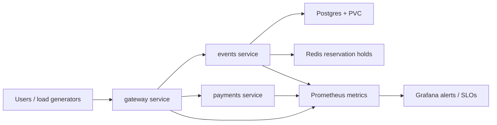

# QuickTicket SRE Handbook

## Architecture



- `gateway` is the public API facade on port 8080. It exposes `/events`, `/events/{id}/reserve`, `/reserve/{id}/pay`, `/health`, and `/metrics`.
- `events` owns event inventory, reservations, Postgres reads/writes, and Redis holds.
- `payments` simulates payment charging and supports fault injection through `PAYMENT_FAILURE_RATE` and `PAYMENT_LATENCY_MS`.
- Postgres is stateful and should run with a PVC. Lab 9 showed `emptyDir` loses orders on pod restart.
- Redis stores temporary reservation holds. If it fails, listing events can continue, but reserve/pay behavior degrades.
- Prometheus scrapes application metrics; Grafana alerting handles high error rate and SLO burn.

## How to Deploy

1. Build or publish the application images.
2. Update Kubernetes manifests or GitOps image tags.
3. Commit and push the change.
4. Let CI build/test images and let ArgoCD sync the desired state.
5. For gateway changes, prefer Argo Rollouts canary:

```bash
kubectl argo rollouts get rollout gateway
kubectl argo rollouts set image gateway gateway=<new-image>
kubectl argo rollouts promote gateway
kubectl argo rollouts abort gateway
```

6. Verify:

```bash
kubectl get pods,svc
kubectl get rs -l app=gateway
kubectl exec deploy/gateway -- python -c "import urllib.request; print(urllib.request.urlopen('http://localhost:8080/health').read().decode())"
```

Deployment guardrails:

- Keep at least 5 gateway replicas for rollout and disruption headroom.
- Run canaries through in-cluster traffic, not `kubectl port-forward`.
- Keep probe endpoints dependency-light for Kubernetes readiness/liveness; expose dependency health separately.

## Monitoring

Primary dashboard: QuickTicket golden signals.

Queries to check:

```promql
sum(rate(gateway_requests_total{status=~"5.."}[5m])) / sum(rate(gateway_requests_total[5m])) * 100
histogram_quantile(0.95, sum by (le, path) (rate(gateway_request_duration_seconds_bucket[5m])))
histogram_quantile(0.99, sum by (le, path) (rate(gateway_request_duration_seconds_bucket[5m])))
up{job=~"gateway|events|payments"}
```

What to look for:

- Availability: gateway 5xx rate, separated from 409 inventory conflicts.
- Latency: p95/p99 by path, especially `/reserve/{id}/pay`.
- Saturation: pod CPU/memory, DB pool usage, Redis health, and pod restarts.
- Rollout health: canary AnalysisRun phase and per-version error rate.

Alert priorities:

- Critical: gateway 5xx > 5% for 2 minutes.
- Warning: SLO burn rate above budget.
- Warning: p99 latency > 500ms for 5 minutes.
- Warning: Redis/Postgres dependency degraded.

## Incident Response

1. Confirm user impact:

```bash
kubectl get pods
kubectl logs deploy/gateway --tail=120 --since=5m
kubectl logs deploy/events --tail=120 --since=5m
kubectl logs deploy/payments --tail=120 --since=5m
```

2. Check health and metrics:

```bash
kubectl exec deploy/gateway -- python -c "import urllib.request; print(urllib.request.urlopen('http://localhost:8080/health').read().decode())"
kubectl top pods -l app=gateway
kubectl top pods -l app=events
kubectl top pods -l app=payments
```

3. Pick mitigation:

- Bad canary: `kubectl argo rollouts abort gateway`.
- Payments fault injection: set `PAYMENT_FAILURE_RATE=0.0` and `PAYMENT_LATENCY_MS=0`.
- Redis down: restore Redis and restart events only if the client connection stays stale.
- DB issue: check Postgres readiness, pool errors, and recent migrations.
- Capacity overload: scale events first, then gateway; keep payments lower unless pay-path metrics show saturation.

4. Verify recovery:

```bash
kubectl rollout status deployment/events --timeout=120s
kubectl rollout status deployment/payments --timeout=120s
kubectl get pods
```

Recovery targets from labs:

- Canary abort: seconds.
- Postgres pod restart with PVC: about 12-20 seconds in the lab.
- Manual dump restore without PVC: about 21 seconds in the measured run, but RPO equals backup age.

Escalate if:

- Error rate remains above threshold for 10 minutes.
- Postgres or Redis cannot stay healthy.
- Recovery requires data restore and backup freshness is uncertain.

## Backup and Restore

Postgres must use a PVC:

- Data path: `/var/lib/postgresql/data/pgdata`.
- PVC: `postgres-data`.
- Backups: CronJob runs `pg_dump` every 5 minutes.
- Retention: keep the newest 5 dump files.

Manual backup:

```bash
kubectl exec deploy/postgres -- pg_dump -U quickticket -d quickticket -Fc -f /tmp/quickticket.dump
kubectl cp default/$(kubectl get pod -l app=postgres -o jsonpath='{.items[0].metadata.name}'):/tmp/quickticket.dump /tmp/quickticket.dump
```

Manual restore:

```bash
kubectl cp /tmp/quickticket.dump default/$(kubectl get pod -l app=postgres -o jsonpath='{.items[0].metadata.name}'):/tmp/quickticket.dump
kubectl exec deploy/postgres -- pg_restore --clean --if-exists -U quickticket -d quickticket /tmp/quickticket.dump
kubectl rollout restart deployment/events
kubectl rollout status deployment/events --timeout=120s
```

RPO/RTO notes:

- With one manual dump, RPO is the age of that dump.
- With PVC, a pod restart should not need restore.
- For production, use managed Postgres or WAL archiving for point-in-time recovery.
